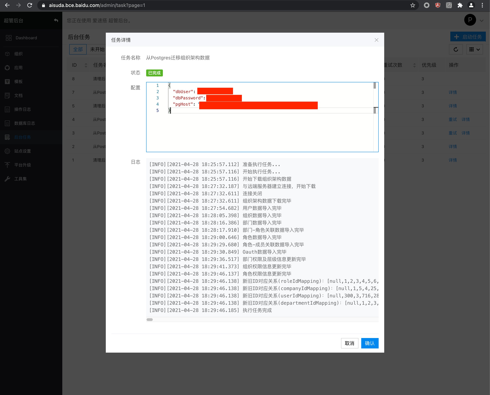

MySQL 版本是爱速搭的下个版本，在这个版本中，平台数据库将改成开发者更为熟悉的 MySQL。

## 功能变化

MySQL 保留了之前 Postgres 版本的所有功能（流程暂时关闭，将在近期重构并开启），同时在数据模型方面进行了改造。

最大的变化是对数据源做了统一，不再严格区分内部外部数据源，并支持手动同步表结构模式，可以用于没有 DDL 帐号的场景。

| 功能         | MySQL 版本           | Postgres 版本      |
| ------------ | -------------------- | ------------------ |
| 数据源       | 不再严格区分内部外部 | 严格区分内部和外部 |
| 内置数据源   | 每个应用可以有多个   | 每个应用只有一个   |
| 外部数据源   | 可以变更表结构       | 无法变更表结构     |
| 手动同步模式 | 支持                 | 不支持             |
| 流程         | 支持任意数据源       | 只支持内置数据源   |

PG 版本支持的数据源模式：

- 自动同步-内置数据源
- 不同步-外部数据源

MySQL 版本中扩展为了 6 种：

- 自动同步-内置数据源
- 手动同步-内置数据源
- 不同步-内置数据源
- 自动同步-外部数据源
- 手动同步-外部数据源
- 不同步-外部数据源

## 权限上的区别

MySQL 版本在权限方面进行了以下调整：

- 默认去掉了组织级别「开发人员」角色，实际使用时发现它和管理员重合度太高，应用有应用级别管理员了。
- 「超级管理员」更名为「组织管理员」，避免和 SaaS 版本的超级管理员命名冲突，超级管理员这个名词用于指 SaaS 版本的管理员。
- 「普通用户」更名为「所有用户」，因为容易造成误解，比如公司领导到底算不算普通用户？
- 应用创建后默认情况下「所有用户」没有访问权限，需要手动分配权限。
- 应用级别角色除了之前的应用级别管理员，还会创建应用级别用户，用于分配浏览权限，用于取代之前的普通用户。
- 应用级别内创建角色会加上应用名前缀，避免和组织级别角色名冲突。

## 界面优化

- 数据源和数据模型的编辑改成弹框，避免页面来回跳转
- 界面微调，更加紧凑

## 新功能

- 可以通过导入的方式来增量更新应用
- 定制主题功能，可以设置变量以及自定义 CSS
- 对象存储功能，使得应用不再只依赖系统全局的对象存储，可以用自己的文件存储

## 迁移方法

MySQL 版本将会是爱速搭后续唯一版本，请尽快迁移到新版本，Postgres 版本将在一个月后进入维护阶段，不再有新功能升级。

首先在以超管身份登录 MySQL 版本，进入【超管后台】，执行后台任务【从 Postgres 迁移组织架构数据】

配置如下

```js
{
  "dbUser": "xxx", // pg版数据库用户名，注意要输入正确的值
  "dbPassword": "xxxx", // pg版数据库密码
  "pgHost": "http://xxx.xxx.xxx.xxx:xxxx" //pg版服务部署地址
```



执行完后可以从打印日志中获得各表新旧ID的对应关系，复制出来供下个任务用
然后执行后台任务【从 Postgres 全量迁移应用】配置如下

```js
{
  "dbUser": "xxx", // pg版数据库用户名，注意要输入正确的值
  "dbPassword": "xxxxx", // pg版数据库密码
  "pgHost": "http://xxx.xxx.xxx.xxx:xxxx" //pg版服务部署地址
  "mapping": { // 上一步输出的新旧ID对应关系表
    "userIdMapping": [], //从上一步输出的 log 中获取
    "roleIdMapping": [], //从上一步输出的 log 中获取
    "companyIdMapping": [], //从上一步输出的 log 中获取
    "departmentIdMapping": [], //从上一步输出的 log 中获取
  }
}
```


