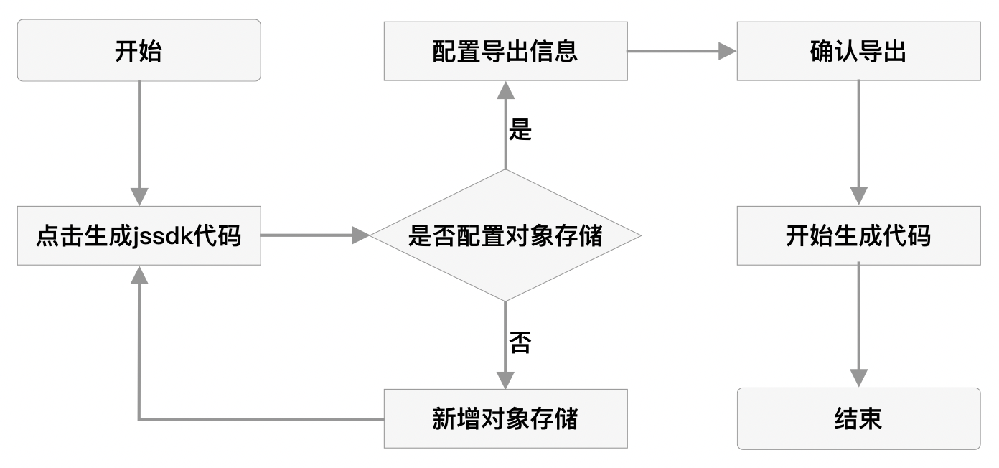
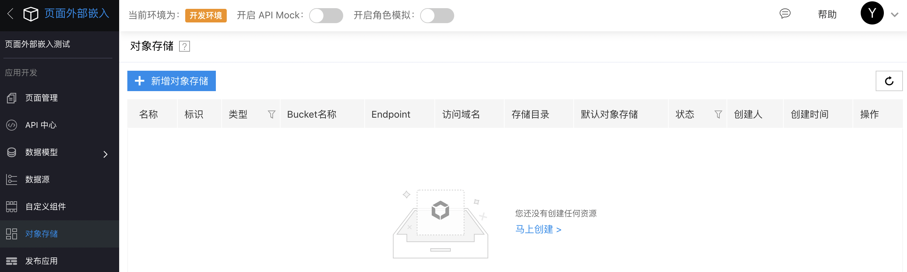
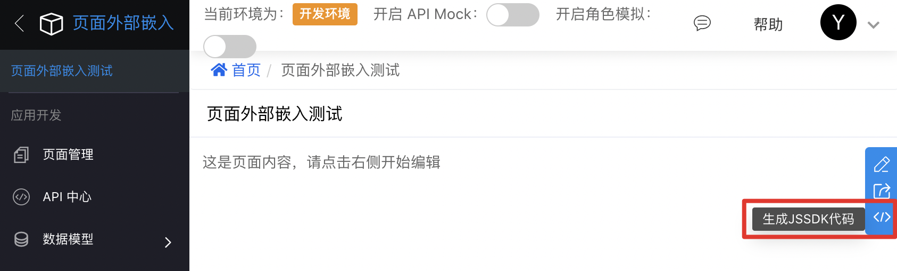
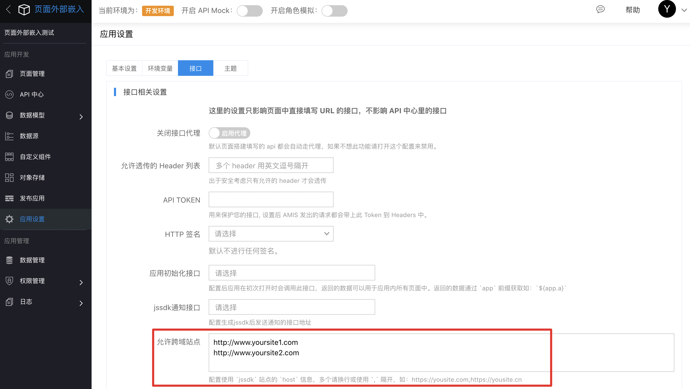
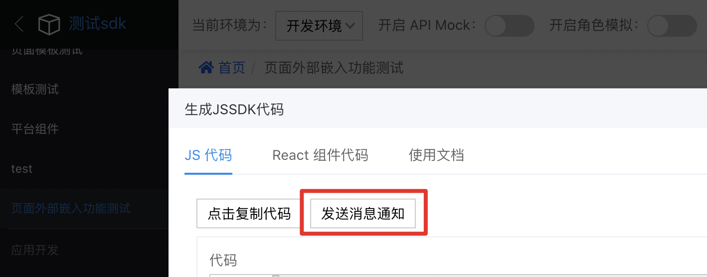
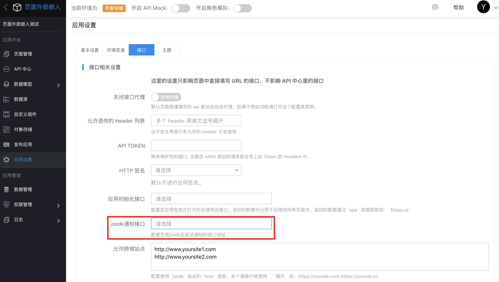

## 页面外部嵌入(jssdk)

### 功能介绍

页面外部嵌入用于导出您在爱速搭开发的单页面，并生成一段代码，用于快速嵌入您已有的业务系统中，从而降低您的开发成本，提升您的开发效率。

### 应用场景

- 已有业务系统，想在不改变已有业务系统架构的基础上同时使用爱速搭。
- 想把您做的好的页面分享给他人使用。

### 功能使用介绍

功能整体使用流程图：



功能使用详细介绍：

- 配置对象存储：如果您想使用该功能，请先在平台配置对象存储，配置入口如图所示：



- 功能入口：功能的入口在页面的右侧，如图所示：



- 点击导出后，您可以选择当前页面导出的环境类型，路由模式以及请求域名。

  - 环境类型：应用的环境类型，默认当前环境。可以选择其他环境，但需要确保当前页面已发布。
  - 路由模式：hash或browser模式，属于浏览器的特性，详细信息可查询文档。
  - 请求域名：如果在API中心配置了请求，可以在这里配置请求域名，修改请求的转发地址，不配置默认爱速搭的域名。

页面成功导出后，会自动生成前端代码，包括script代码以及react组件示例

- script 代码
```html
<!DOCTYPE html>
<html lang="en">
<head>
    <meta charset="UTF-8">
    <meta http-equiv="X-UA-Compatible" content="IE=edge">
    <meta name="viewport" content="width=device-width, initial-scale=1.0">
    <title>test</title>
</head>
<body>
    // 将『{{loderUrl}}』替换为导出的loader文件地址
    <script src="{{loderUrl}}"></script>

    <div id="root"></div><
    <script>
        // 将『{{pageUrl}}』替换为导出的page文件地址
        amisLoader.load('{{pageUrl}}', ((page) => {
            const data = {key: "value"};
            page.mount("#root", page.schema, data);
        }));
    </script>
</body>
</html>
```

- react 公共组件代码
```javascript
/**
 * @file common/aisudaPage.tsx
 */

import * as React from 'react';

interface AisudaPageProps {
  /**
   * 加载器 Url
   */
  loaderUrl: string;

  /** 页面 Url */
  pageUrl: string;

  data?: any;
}

export class AisudaPage extends React.Component<AisudaPageProps> {
  static defaultProps: Pick<AisudaPageProps, 'loaderUrl'> = {
    // 将『{{loderUrl}}』替换为导出的loader文件地址
    loaderUrl: '{{loaderUrl}}'
  };

  rootDom = React.createRef<HTMLDivElement>();
  unmounted = false;
  currentPage: any = null;

  componentDidMount() {
    this.loadAMISLoader(this.props.loaderUrl, loader => {
      if (this.unmounted) {
        return;
      }

      loader.load(this.props.pageUrl, (page: any) => {
        // 替换请求域名
        const data = {
          AISUDA_HOST: 'http://localhost.aisuda.bce.baidu.com:8089',
          ...this.props.data
        };
        this.currentPage = page;
        this.rootDom.current &&
          !this.unmounted &&
          page.mount(this.rootDom.current, page.schema, data);
      });
    });
  }

  componentDidUpdate() {
    this.currentPage?.updateProps({
      data: this.props.data
    });
  }

  componentWillUnmount() {
    this.unmounted = true;
    this.currentPage?.unmount();
  }

  loadAMISLoader(url: string, callback?: (loader: any) => void) {
    if ((window as any).amisLoader) {
      callback?.((window as any).amisLoader);
      return;
    }

    const script = document.createElement('script');
    script.setAttribute('type', 'text/javascript');
    script.onload = () => {
      callback?.((window as any).amisLoader);
    };
    script.setAttribute('src', url);

    document.body.appendChild(script);
  }

  render() {
    return <div ref={this.rootDom}>Loading...</div>;
  }
}
```

- react 组件示例代码
```js
/**
 * @file jssdkReactComp.tsx
 *
 */

import * as React from 'react';
import {AisudaPage} from '@common/aisudaPage';

export default function TestComp() {
  // 将『{{pageUrl}}』替换为导出的page文件地址
  const pageUrl = '{{pageUrl}}';
  const data = {customData: 'this is custom data'};

  return (
    <>
      <AisudaPage pageUrl={pageUrl} data={data} />
    </>
  );
}
```

- 其他框架使用

该功能提供了两个核心文件：`loaderUrl` 和 `pageUrl`，加载 `loaderUrl` 后会在全局挂载一个 `amisLoader` 对象，然后就可以通过 `amisLoader.load` 加载对应的页面。

### 使用文档

`amisLoader.load` 方法接受两个参数，参数说明如下：

- pageSrc: 类型为string，页面信息存储的地址，如：http://bucket.endpoint/key.js
- 回调函数：回调函数接受一个参数page，类型为 `PageProsp` ，具体内容见 `PageProsp`

PageProsp 中的参数以及方法说明如下：

- schema：页面的schema信息
- mount：挂载页面的方法，第一个参数可以是ID选择器，也可以是dom节点(ref)；第二个参数是页面的schema，既 `PageProsp.schema`；第三个参数是页面需要的数据
- unmount：卸载页面的方法，第一个参数可以是ID选择器，也可以是dom节点(ref)。
- updateProps: 更新页面数据的方法。

### 其他说明

- 如果您使用了API中心的请求，且导出后请求域名为爱速搭平台，既爱速搭平台代理您的请求，需要进行以下设置：
  - 您的应用必须是 https，并且确保有 header X-Forwarded-Proto: https 透传到实例
  - 配置 docker env ISUDA_COOKIE_SAMESITE 为 none
- 应用设置/接口 中将使用 jssdk 的站点 host 信息填入到允许跨域站点列表中



- 我们提供了一个通知功能，您可以在 API中心新增一个接口，然后在 应用设置/接口 中配置jssdk通知接口，配置之后，当您导出页面之后，点击 发送消息通知，我们会将您当前导出的页面 `pageurl` 、`loaderUrl` 等信息发送给您配置的接口。




