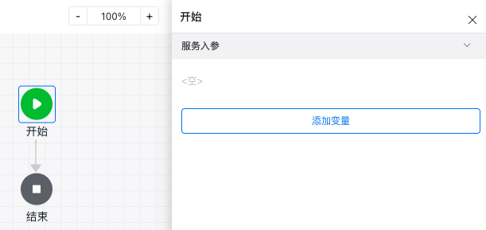
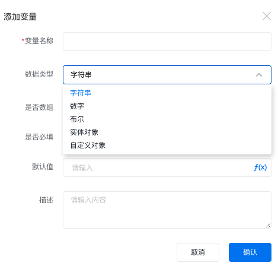
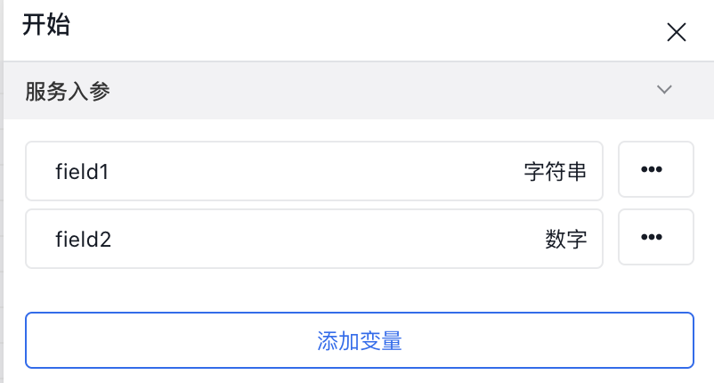
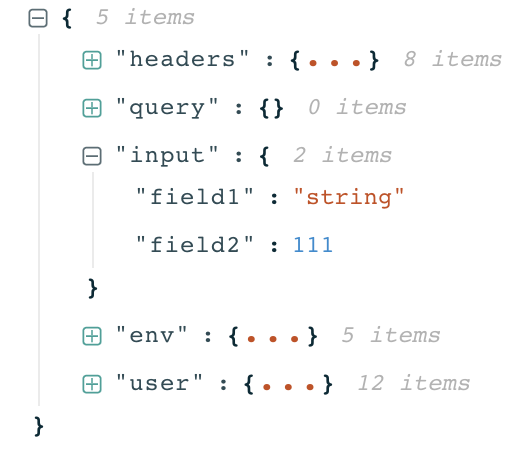
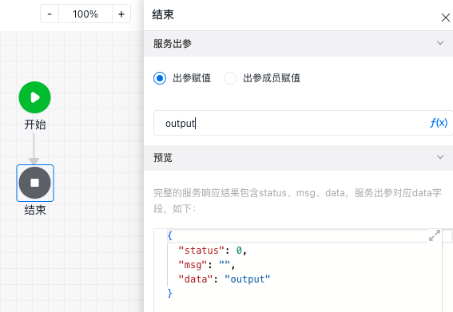
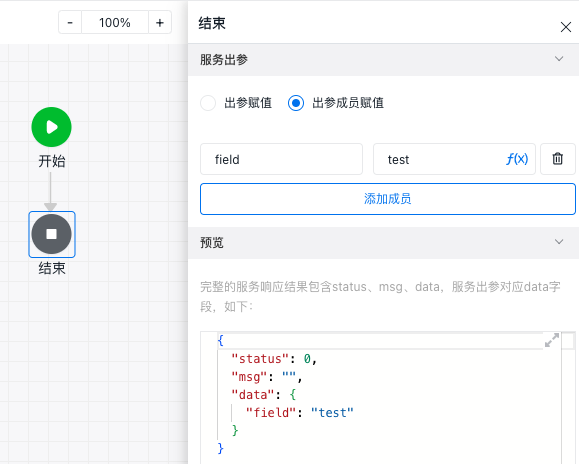

# 变量及输入输出参数配置

变量的输入输出参数指的是API编排中『开始节点』和『结束节点』的参数设置。

『开始节点』的参数设置可以配置API编排接口的入参input，可以设置必输和默认值；
『结束节点』的参数设置可以配置API编排接口的出参output，可以设置出参的字段、格式等。

## 『开始节点』输入参数配置

点击开始节点后可以看到服务入参，可以通过添加变量可以配置服务入参，其中服务入参有以下类型：
* 字符串
* 数字
* 布尔
* 实体对象
* 自定义对象
* 数组

其中数组中的元素可以是字符串、数组、布尔、实体对象或自定义对象，通过设置是否数组来定义

设置完成输入参数后，可以在调用或者调试api时，在上下文中的input字段中获取

## 『结束节点』输出参数配置
『结束节点』可以通过出参赋值或出参成员赋值来设置API编排的出参，设置出参有两种方式
* 出参赋值
* 出参成员赋值

### 出参赋值

出参赋值指的是设置的出参直接作为响应中的data，如下：

### 出参成员赋值

出参成员赋值指的是设置的出参作为响应中data对象的其中一个属性，如下：

 