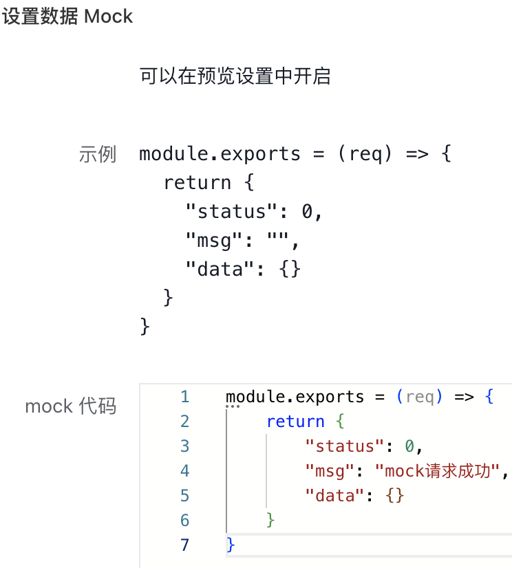
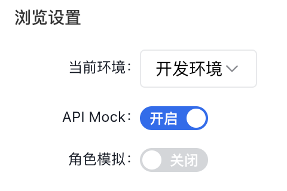

# 如何Mock服务编排

Mock服务主要是通过自定义JS脚本，在开发环境的预览态，实现对API中心接口的mock功能。

## 如何设置Mock

在API列表-更多中有『mock』选项，点击后进入设置弹出设置mock的窗口。mock功能的js代码示例和返回格式如下：

## 如何开启mock

在开发环境下，点击『预览』，进入预览态。 在预览态下的浏览设置中，开启『API Mock』。

开启后，对API中心的接口请求时，不会实际请求API中心的节点，而是直接执行配置好的mock脚本进行返回。

