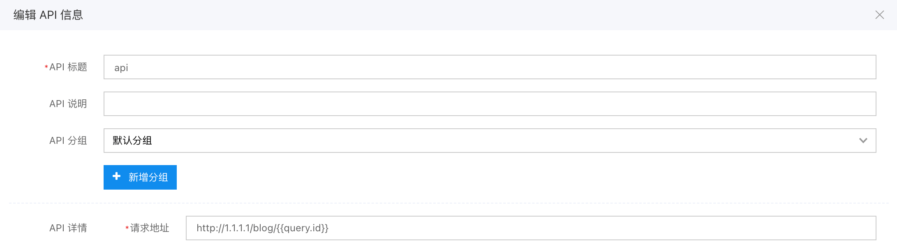
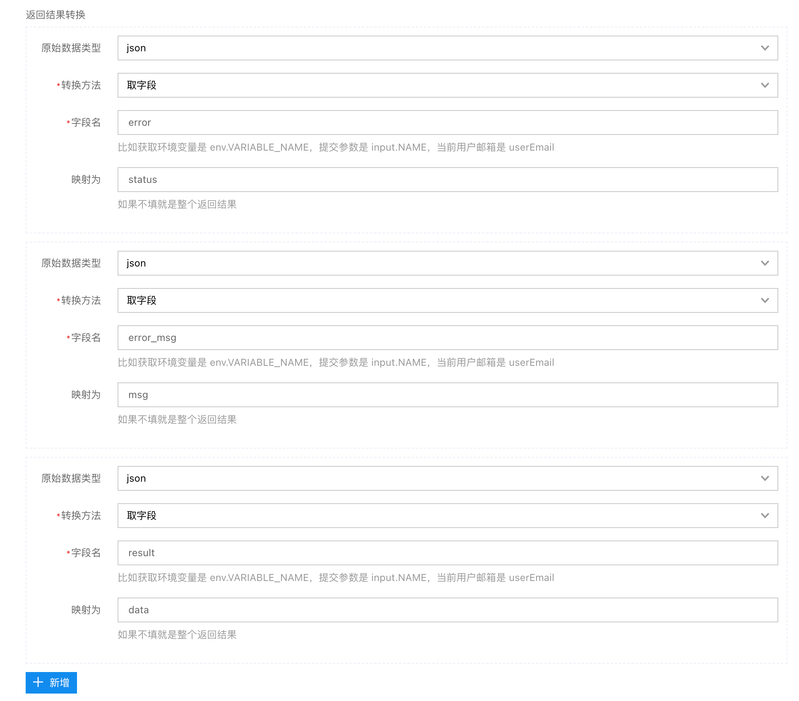

# 如何管理服务编排

介绍如何管理 API，「包括单 API 及服务编排」包括 API 的新建，批量导入，编辑、删除、复制、使用情况、调试、Mock、禁用

#### 进入 API 管理

在开发环境中从左侧 API 管理进入


#### 新建单个 API


新建单 API 时可以配置如下信息：

- 基本信息
  - API 标题：取一个好记的 API 标题吧
  - 请求地址：API 访问的第三方服务的地址
  - API 标识：唯一标识，可自定义，不填将随机创建
  - API 分组：选择 API 属于哪个分组，方便
  - 请求格式：json/表单/文件上传
  - 重试次数：请求失败时，重新请求的次数
  - API 说明：描述信息，用于标识当前 API 的用途
- 服务入参
  - 入参配置：用于配置调用时传入参数的 名称，格式，是否必填
- 请求配置
  - Query 转换：对请求 query 进行转换,可配置追加或者覆盖模式
  - Header 转换：对请求 body 进行转换,可配置追加或者覆盖模式
  - Body 转换：对请求 header 进行转换,可配置追加或者覆盖模式
- 响应配置
  - 是否文件下载：当前 API 是否是文件下载服务
  - 返回结果转换：对访问第三方服务的结果进行转换，转换规则支持：
    - 取字段，用于将数据复制到返回结果的某个字段下；
    - JSON 路径查询；
    - 模板，使用 Handlebars 模板对结果进行转换；
    - 正则，抽取第一个组，通常用于 xml 中直接获取某个数据；
    - 详见 如何进行返回结果转换
  - 返回结果适配：JS 代码形式处理返回结果；
- 服务出参

  - 出参配置：用于配置返回时输出参数的 名称，格式，是否必填

- 认证鉴权
  - 请求验证方式：
    - HTTP 帐号密码。
    - JWT，将会对所有 query 及 header 及进行签名，写入 header 的 Authorization 字段中。
    - 百度云，将会对提交数据及 header 都做签名，写入 header 的 Authorization 字段中
    - 第三方签名，将用户信息发送给另外一个接口，返回 token 字段，此 token 写入 header 的 Authorization 字段中。这个 token 将被缓存 15 分钟左右。
  - 自定义证书：可配置证书 key 及 cert

#### 新建服务编排


服务编排新建时只需要少量信息，详情再在可视化编排编辑器中配置，新建服务编排时可以配置如上图所示信息。

如下图所示进入编排配置, 点击列表行操作的服务编排按钮；


#### 批量导入

批量导入功能允许用户直接通过 swagger 格式的 API 配置文件，批量创建 API


#### 更多操作

- 删除：删除 API
- 复制：直接复制 API，快速创建一个新的 API
- 使用情况：可查看在页面中的使用情况
- 调试：调试 API 是否可用
- mock：设置请求 Mock,详见[如何 Mock](./%E5%A6%82%E4%BD%95Mock%E6%9C%8D%E5%8A%A1%E7%BC%96%E6%8E%92.md)
- 禁用：禁用后的 API，页面中将不能再调用
  

#### 调试 API


#### URL 地址替换

「请求地址」支持变量替换，比如这个例子 `http://1.1.1.1/blog/{id}`，其中的 id 是动态的，而在实际前端调用的时候，请求地址是类似 `/api/center/nicaVyNdbGmHicn5b3EKkU`，如何将它映射到目标地址的路径中？

方法是首先在前端请求的时候映射 query，比如 `post:api://nicaVyNdbGmHicn5b3EKkU?id=${id}`，然后在 api 中的 url 地址填写 `http://1.1.1.1/blog/{{query.id}}`



除了 `query` 来获取 query，还有以下其它变量：

- `env`，环境变量
- `input`，提交参数
- `headers`，header

#### 请求配置

API 中请求配置中的 Body、Query（URL 参数）、Header 都可以进行修改，转成对应接口所需的格式。

如下图所示：


- 可选择转换模式为追加字段或覆盖所有字段
- key 配置为 & 时；可以直接将配置的值展开
- 配置的变量将默认从 input 对象上获取，例如这里的 data 及 pageNo,运行时获取的值是 input.data 和 input.pageNo
- 获取环境变量为 env.xxx;获取系统变量为 user.xxx;环境变量和系统变量可以可视化通过公式编辑器中获取，也可以做公式计算

#### 返回结果转换

爱速搭接口所需的返回格式是：

```json
{
  "status": 0,
  "msg": "",
  "data": {
    ...其他字段
  }
}
```

- **status**: 状态码，返回 `0` 表示当前接口正确返回，否则按错误请求处理
- **msg**: 返回接口处理信息，主要用于表单提交或请求失败时的 `toast` 显示
- **data**: 返回的具体数据

同时也兼容以下几种放回格式

1. errorCode 作为 status、errorMessage 作为 msg
2. errno 作为 status、errmsg/errstr 作为 msg
3. error 作为 status、errmsg 作为 msg
4. error.code 作为 status、error.message 作为 msg
5. message 作为 msg

如果返回的内容不是这些格式，或者返回内容不是 JSON，则需要对返回结果进行转换。

转换方法有以下几种：

1. 取字段，用于将数据复制到返回结果的某个字段下
2. JSON 路径查询
3. 模板，使用 Handlebars 模板对结果进行转换
4. 正则，抽取第一个组，通常用于 xml 中直接获取某个数据

这里介绍最常见的「取字段」方法，假设接口返回格式是：

```json
{
  "error": 0,
  "error_msg": "",
  "result": {}
}
```

我们希望转成如下格式

```json
{
  "status": 0,
  "msg": "",
  "data": {}
}
```

就需要通过「取字段」的方式提取这 3 个值到不同位置，如下图所示：



#### 文件上传

如果是文件上传，请将基本信息中「请求格式」设置为「文件上传」。


#### 文件下载

如果是文件下载接口，请开启响应配置中的「是否文件下载」


