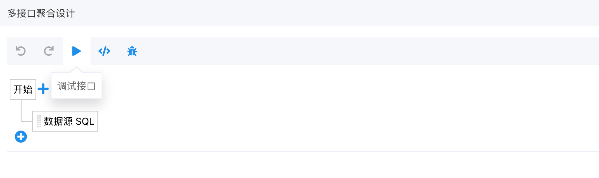
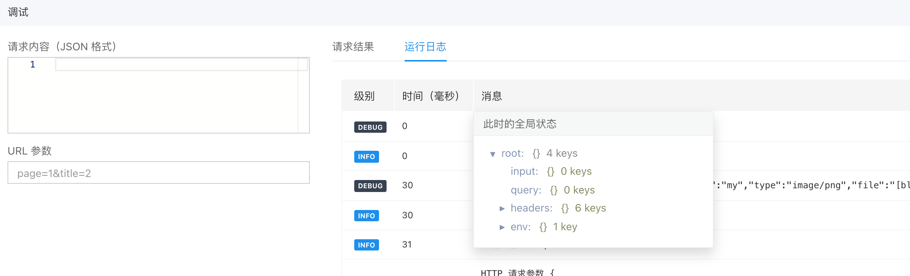

# 如何运行调试服务编排

调试服务编排主要是用于开发模式下，对API编排中各个节点进行执行和上下文日志的打印。 通过打印运行日志来调试API编排。

可以在API编排设置中可以找到『调试接口』进行debug。

## 调试服务编排的输入和输出

进入调试页后，可以通过请求内容设置API编排的请求体，通过URL参数设置URL中的请求变量

运行调试服务后，会输出一下两部分：
* 请求结果：指API编排执行结束时返回的响应体
* 运行日志：打印API编排执行中的全局变量和执行日志

## 调试服务中全局变量的打印

在调试服务的运行日志中，会打印当前执行的环境变量，用于给用户展示当前运行节点的参数状态，主要有以下参数：
* input：API调试时输入的请求内容，即请求体。运行中可修改。
* query：API调试时输入的URL参数，即URL参数。运行中可修改。
* header：API调试时的请求头。运行中可修改。
* env：用户设置的应用级别环境变量，API调试时是开发环境下的环境变量。

