## 场景简介
「单API节点」适用于仅发送一个API的操作，他与API编排最大的不同是，API编排支持多个节点的组合排列形成一个复杂的请求场景。在单API节点中你只能发送一个API请求。
### 创建单API
通过「API管理」按钮可以进入API编排页面，选择「新增」「API」即可编写创建单API
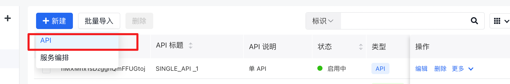
### 普通单API转发
适用于发送一个普通的API请求，仅仅作为转发。
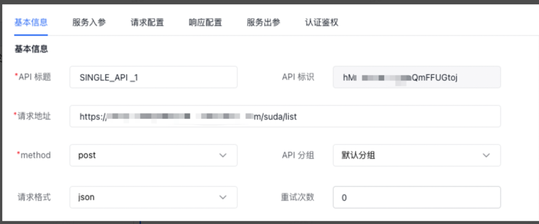
### 表单类型转发
适用于发送一个表单类型的数据，当然也可以根据请求格式选择不同种类的请求。这里支持json、表单、文件上传格式，分别对应了不同类型的转发。
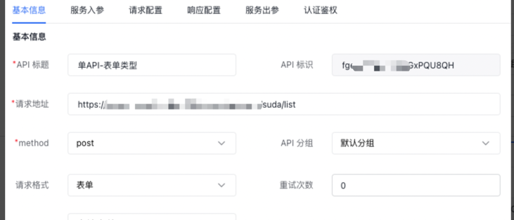
### 文件上传
适用于上传文件类型的请求。注意：如果表单里面有文件上传，但是在此没有选择文件上传类型，那么转发时也会强制转为文件上传格式。
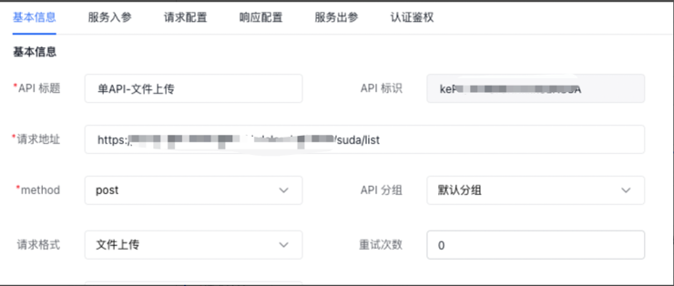
### query转换
支持对转发参数做处理，支持追加和覆盖两种类型。参数值支持公式编辑器模式，支持三种格式写法：${xxx.xxx}、{{xxx.xxx}}、xxx 三种。
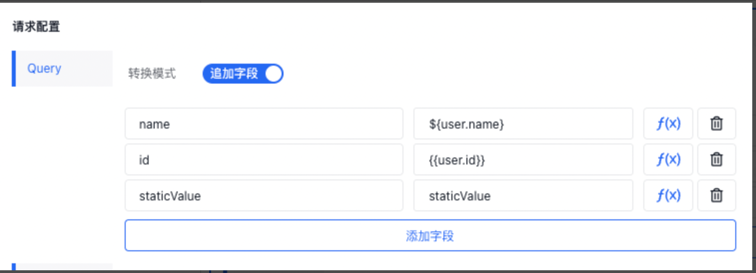
### header转换
支持对转发headers做处理，支持追加和覆盖两种类型。参数值支持公式编辑器模式，支持三种格式写法：${xxx.xxx}、{{xxx.xxx}}、xxx 三种。
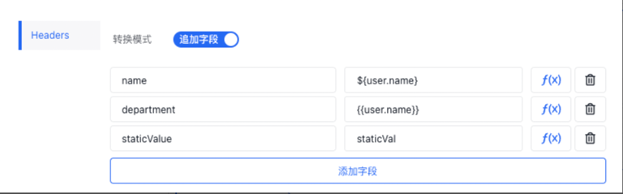
### 返回结果适配
支持对返回结果进行适配，当接口返回值不满足业务需求时，可以在此进行适配。仅支持js语法。
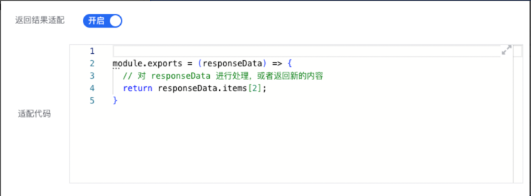
### 返回结果转换
支持对返回结果进行转换，满足三种格式的转换类型「取字段」、「JSON路经查询」、「模版」。参数类型支持三种格式，分别对应返回「json」、「xml」、「字符串」满足不同类型的接口数据返回。
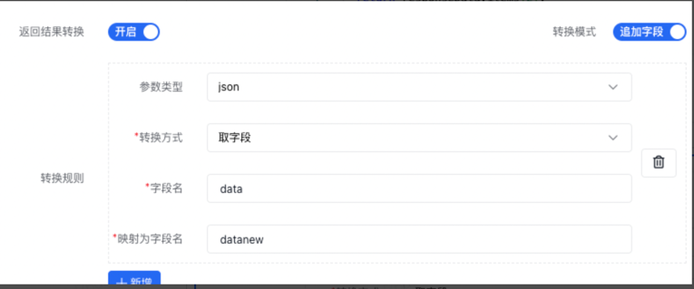
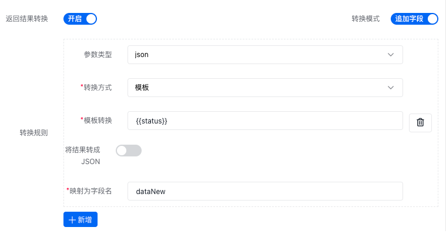
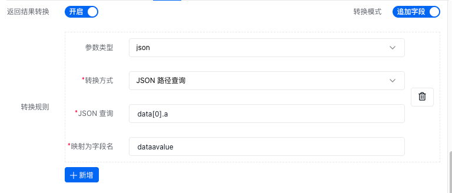
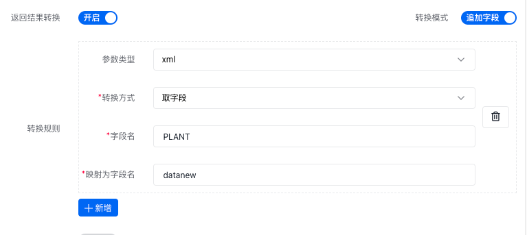
### 认证签名
可以对API请求加签，支持百度云、http basic、JWT、第三方签名。
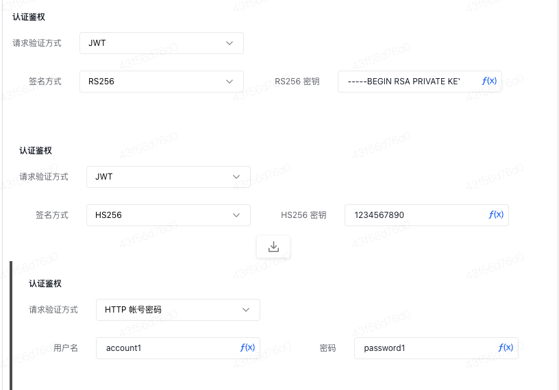