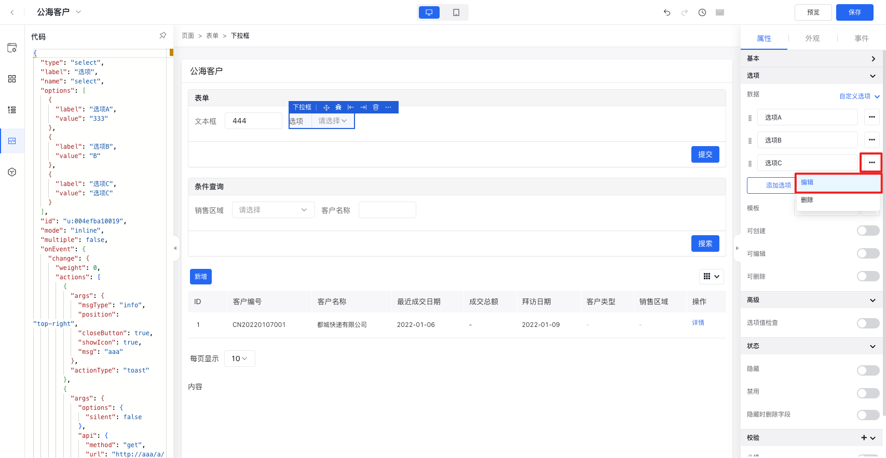
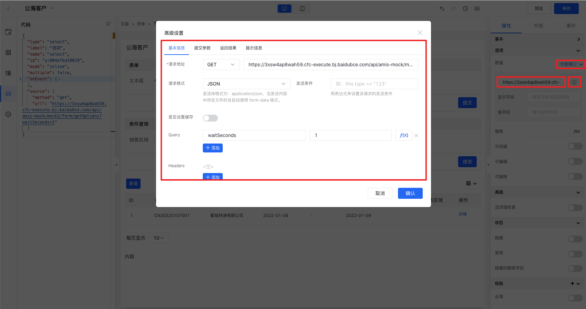
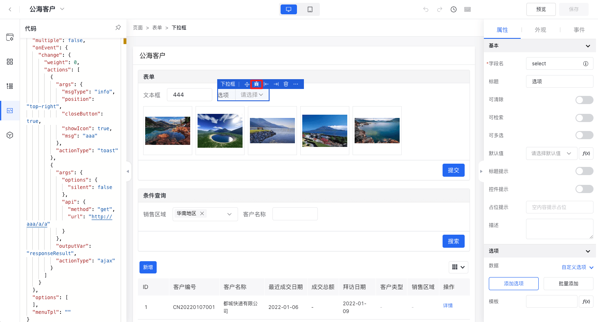
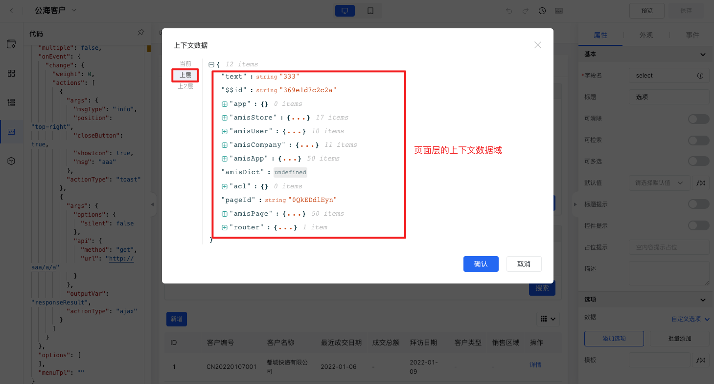
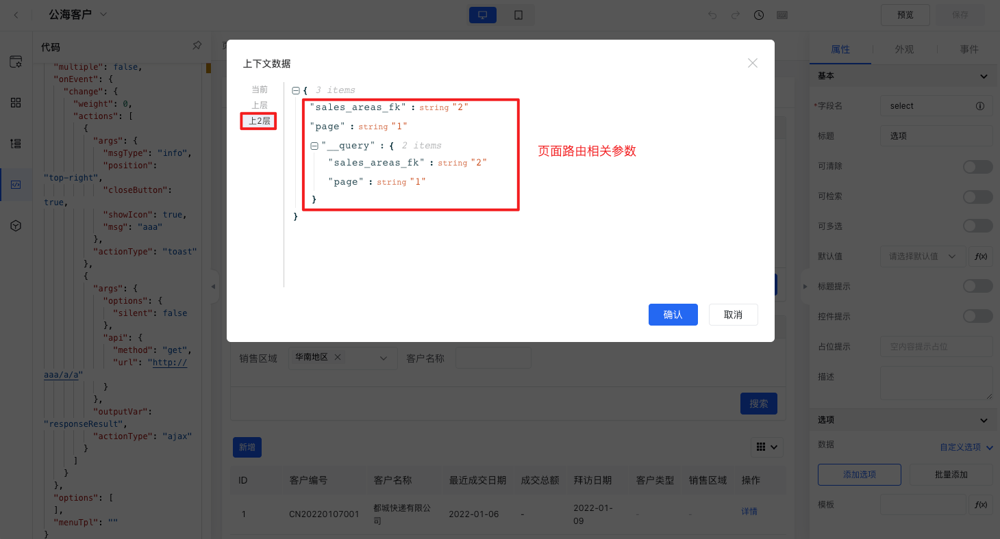

`数据域`决定了组件可以访问哪些数据，`页面数据域`（顶级数据域）可以被页面内所有组件访问。

## 数据类型

`数据域`中的数据类型包含以下几类：

* 静态数据：是指页面初始就存在的固定数据，这些数据的变量名是固定的，值可以是写死的，也可以是一个变量。在爱速搭中静态数据变量包含系统变量、应用级变量、页面
* 接口数据：是指通过远程接口或者API中心接口拉取的远程数据。
* 交互数据：是指通过组件交互产生的数据，例如下拉框选中的值、表单提交的数据。
* 实体数据：是指通过关联指定的实体模型来获取的表数据，例如增删改查、模型列表、模型表单组件所关联的实体模型数据。

## 数据查找规则

`数据域`查找规则遵循[Amis数据链](https://baidu.github.io/amis/zh-CN/docs/concepts/datascope-and-datachain)，查找过程如下：
* 首先，尝试在当前组件的数据域中查找变量，命中则停止查找，并通过数据映射完成渲染。
* 在当前数据域中未命中该变量，则向上查找。
* 在父组件的数据域中，重复步骤1和2，直至顶级组件（即页面）。
* 如果页面路由地址（Url）中有 `query` 参数，则查找 `query` 参数这层，否则停止查找。

## 注意事项

* 页面、表单、服务、增删改查、向导、弹窗、抽屉这类容器组件具备自己的数据域，即可以单独为这些组件配置数据域。
* 当组件存在嵌套关系时，按照`Amis数据链`查找规则将最近的数据域中的变量作为最终的值。
* 页面、服务组件可以通过`初始化静态数据`、`初始化接口`配置项来定义组件当前层的数据域。
* 表单、增删改查、向导组件可以通过`初始化接口`配置项来定义组件当前层的数据域，当然也可以在“代码”中通过`data`属性来定义。
* 弹窗和抽屉是通过`数据映射`配置项将弹窗之外的数据映射到弹窗或抽屉的数据域中进行使用的。
* 当同时配置了静态数据和远程动态数据（接口数据、实体数据）时，如果存在同名变量，动态数据将覆盖静态数据。
* 部分组件只能通过绑定变量的方式指定数据源，例如表格组件。

接下来详细介绍一下在页面设计器中如何定义页面全局数据、如何为组件绑定数据、如何读取数据域中的数据变量。

## 页面数据域

在页面设计过程中，有时需要一些全局变量来存储一些固定的数据（即定义页面的数据域），以便于页面内所有组件访问使用。

定义页面数据的场景：

* 配置页面参数：主要是定义页面入参名称，便于在设计过程中进行绑定使用。
* 配置页面静态数据：主要是定义一些固定的变量，便于页面内所有组件绑定使用。
* 配置页面远程数据：主要用于异步数据的场景，通过接口远程拉取的方式来填充页面数据域。

下面介绍一下具体的配置方法。

### 内置变量

除了应用环境变量中定义的环境变量外，页面中还可以访问内置变量，分别为：

- `ISUDA_USER_NAME` 当前登录用户的用户名
- `ISUDA_USER_DISPLAY_NAME` 当前登录用户的显示名（昵称）
- `ISUDA_USER_EMAIL` 当前登录用户的邮箱
- `ISUDA_NOW` 当前时间，时间戳格式
- `ISUDA_COMPANY_KEY` 当前组织 key
- `ISUDA_APP_KEY` 当前应用 key
- `ISUDA_APP_KEY` 当前应用 key
- `ISUDA_TENANT_ID` 当前租户 id

比如： `${ISUDA_USER_NAME}`，环境变量可以用在页面中任意位置。

> 注意：部分配置项已通过公式编辑器提供可视化的系统变量选择，无需手写。

### 配置页面参数

在页面设计过程中，通过页面参数功能可以定义该页面的入参结构，以便在交互设计过程中通过可视化的配置方式去引用这些参数，定义方法如下：

1. 点击页面设计器左侧页面参数图标，将显示页面参数配置面板。
2. 点击“添加属性”按钮，将显示字段配置相关表单项。
3. 输入字段名、显示名，选择是否必填（是否必填的用途是为了在跳转到该页面的时候可以提示用户设置对应字段名的页面入参）。
4. 输入完成后，即可在组件配置面板中需要绑定页面数据的地方进行访问。

### 配置页面静态数据

1. 在页面设计器画布选择页面组件，右侧将显示页面组件配置面板。
2. 在“属性”选项卡->”数据“折叠面板中进行页面变量的配置。
3. 在初始化静态数据那里，点击”新增“按钮。输入key、value，分别代表变量名和变量值。
4. 输入完成后，即可在页面内子组件配置面板中需要绑定页面数据的地方进行访问。

### 配置页面远程数据

* 1. 在页面设计器画布选择页面组件，右侧将显示页面组件配置面板。
* 2. 在“属性”选项卡->”数据“折叠面板中进行页面变量的配置。
* 3. 在初始化接口那里，可以选择”外部接口“或者”API中心“。如果选择”外部接口“，可以直接输入接口地址，如需更高级的配置需要点击右侧的”设置“图标，将弹出高级设置，可以配置接口的基本信息、提交参数、返回结果、提示信息；如果选择”API中心“，可以切换”初始化接口“右侧的下拉选择，选择”API中心“，点击输入框右侧的图标即可唤起”API中心列表“，选择所需分组下的API，点击”确认“提交即可。
* 4. 配置完成后，即可在页面内子组件配置面板中需要绑定页面数据的地方进行访问。

## 组件数据

部分容器类组件可以通过`初始化静态数据`或者`初始化接口`配置项来设定初始化时组件当前的数据域，例如：页面、服务、增删改查这类可以包含子组件的、具备独立数据域的组件，都可以参考上面的页面数据域的配置方式。

而组件数据是指组件自身的数据源，例如下拉框、图片集等这些需要绑定具体的选项数据、图片数据才能够正常使用。

下面分别以下拉框和图片集组件为例来说明组件数据的配置方法。

### 绑定静态数据

1. 在页面设计器画布选择下拉框组件，右侧将显示页面组件配置面板。
2. 在“属性”选项卡->”选项“折叠面板->“数据”中进行页面变量的配置，下拉框支持三种数据配置方式，分别为”自定义选中项“、”外部接口“、”API中心“。
3. 选择”自定义选项“方式，点击”添加选项“按钮，将新增一个选项输入框，在输入框输入选项文本或值，此时表示选项名和选项值都为输入的内容，如果名字与值不同，可以点击右侧的”...“按钮进行详细的配置。
4. 配置完成后进行预览，点击下拉框即可在下拉列表中看到上面添加的数据选项。

### 绑定远程数据

1. 在页面设计器画布选择下拉框组件，右侧将显示页面组件配置面板。
2. 在“属性”选项卡->”选项“折叠面板->“数据”中进行页面变量的配置，下拉框支持三种数据配置方式，分别为”自定义选中项“、”外部接口“、”API中心“。
3. 在数据那里，可以选择”外部接口“或者”API中心“。如果选择”外部接口“，可以直接输入接口地址，如需更高级的配置需要点击右侧的”设置“图标，将弹出高级设置，可以配置接口的基本信息、提交参数、返回结果、提示信息；如果选择”API中心“，可以切换”初始化接口“右侧的下拉选择，选择”API中心“，点击输入框右侧的图标即可唤起”API中心列表“，选择所需分组下的API，点击”确认“提交即可。
4. 配置完成后进行预览，点击下拉框即可在下拉列表中看到接口远程拉取的数据选项。

### 绑定变量

1. 为图片集组件的父组件的数据域配置图片集数据，这里选择为表单组件添加data数据域配置。
2. 在页面设计器画布选择图片集组件，右侧将显示图片集组件配置面板。
3. 在“常规”选项卡->“数据源”中选择”关联字段“，输入表单组件数据域中定义的变量
4. 配置完成后进行预览，将看到图片集展示为变量的数据。

## 访问数据

上面讲了数据域、数据查找规则、页面数据域定义方法、组件数据定义方法，下面说明一下如何访问组件当前数据域、上层数据域中的数据变量、如何访问组件的数据。

访问数据域的场景：

* 绑定组件数据源：组件数据来源依赖数据域中的变量，例如下拉框、复选框、表格、穿梭框等关联数据源的组件想要绑定动态数据的场景
* 设置组件默认值：组件默认值依赖数据域中的变量，例如输入框、下拉框、树选择框等表单项组件在页面初始化时想要展示一个默认值的场景。
* 作为远程请求的参数：发送 http 请求时需要携带页面数据域中的变量、组件数据、交互数据等，例如增删改查组件初始化接口发送时需要携带其他表单的表单项值作为采参数、点击目录树节点时发送的 http 请求需要携带所选中的节点信息。

在页面设计器中，访问数据的方式：

* 公式编辑器
* 组件上下文debug

### 公式编辑器

组件有些配置项提供了公式编辑器入口，在[公式编辑器](./%E5%85%AC%E5%BC%8F%E7%BC%96%E8%BE%91%E5%99%A8.md)中可以看到可用的所有层级的数据域下的变量。如下图：

### 组件上下文debug

组件上下文debug功能也能帮助用户了解当前组件的上下文内容，能够查看组件当前层、上层、更上层的数据域情况。

使用方法：

1. 选中一个组件，点击组件上面的小工具条中的“debug”图标，唤起“上下文数据”弹窗
2. 切换左侧层级导航，可以查看从当前层向上的数据域
3. 所能看到的数据变量可以在组件配置面板通过“${变量名}”进行使用

