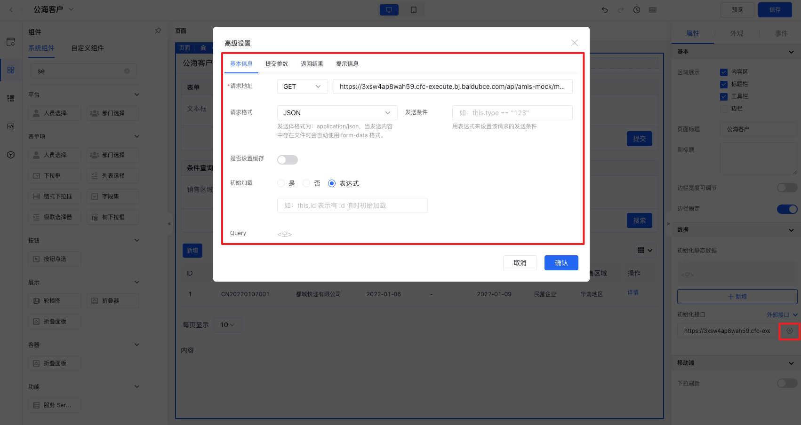
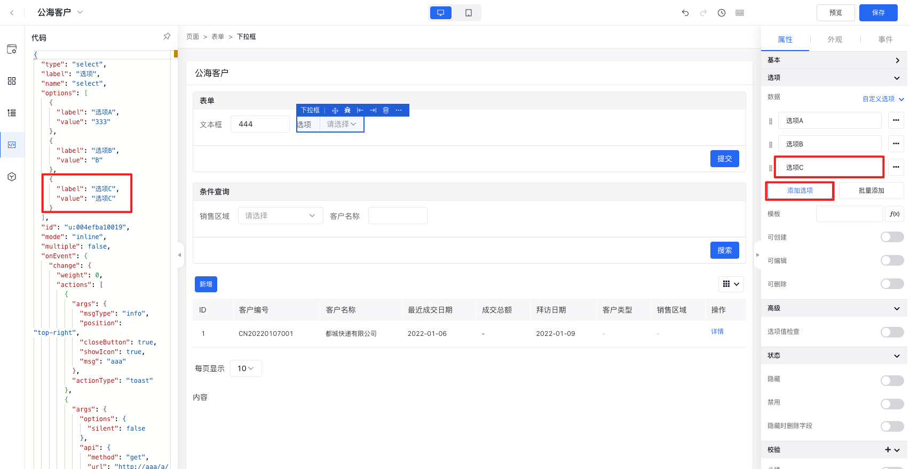
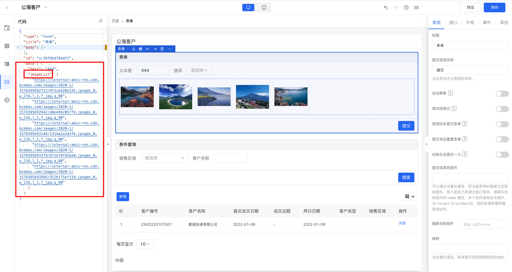

页面中的数据全部存在于一个全局的数据域中，每个组件都有自己的数据域，数据域决定了组件可以访问哪些数据。数据域中的数据类型包含以下几类：

* 静态数据：是指页面初始就存在的固定数据，这些数据的变量名是固定的，值可以是写死的，也可以是一个变量。在爱速搭中静态数据变量包含系统变量、应用级变量、页面
* 接口数据：是指通过远程接口或者API中心接口拉取的远程数据。
* 交互数据：是指通过组件交互产生的数据，例如下拉框选中的值、表单提交的数据。
* 实体数据：是指通过关联指定的实体模型来获取的表数据。

数据域查找规则遵循Amis数据链，查找过程如下：
* 首先，尝试在当前组件的数据域中查找变量，命中则停止查找，并通过数据映射完成渲染。
* 在当前数据域中未命中该变量，则向上查找。
* 在父组件的数据域中，重复步骤1和2，直至顶级组件（即page组件）。
* 如果页面路由地址（Url）中有 query 参数，则查找 query 参数这层，否则停止查找。

## 注意事项：

* 页面、表单、服务、增删改查、向导、弹窗、抽屉组件具备自己的数据域，即可以单独为这些组件配置数据域。
* 当组件存在嵌套关系时，按照Amis数据链查找规则将以自下而上最近的数据域中的变量为准。
* 目前设计器中只有页面、服务组件提供了”初始化静态数据“可视化配置，只有页面、表单、服务、增删改查、向导组件提供了”初始化接口“可视化配置。
* 弹窗和抽屉只提供了数据映射能力，即将页面中组件数据映射到弹窗或抽屉的数据域中进行使用。
* 当同时配置了静态数据和动态数据（接口数据、实体数据）时，如果存在同名变量，动态数据将覆盖静态数据。

接下来详细介绍一下在页面设计器中如何定义页面全局数据、如何为组件绑定数据、如何读取数据域中的数据变量。

## 页面参数

在页面设计过程中，通过页面参数功能可以定义该页面的入参结构，定义方法如下：

* 1. 点击页面设计器左侧页面参数图标，将显示页面参数配置面板。
* 2. 点击“添加属性”按钮，将显示字段配置相关表单项。
* 3. 输入字段名、显示名，选择是否必填（是否必填的用途是为了在跳转到该页面的时候可以提示用户设置对应字段名的页面入参）。
* 4. 输入完成后，即可在组件配置面板中需要绑定页面数据的地方进行访问。

## 页面数据

在页面设计过程中，有时需要一些全局变量来存储一些固定的数据，以便于页面内所有组件访问使用。页面组件一般作为页面的顶级组件，可以通过配置页面组件的初始化数据来实现全局变量的定义，页面数据也属于组件数据，因为页面也是组件。

下面介绍一下页面数据的配置方法。

静态数据配置方法：

* 1. 在页面设计器画布选择页面组件，右侧将显示页面组件配置面板。
* 2. 在“属性”选项卡->”数据“折叠面板中进行页面变量的配置。
* 3. 在初始化静态数据那里，点击”新增“按钮。输入key、value，分别代表变量名和变量值。
* 4. 输入完成后，即可在页面内子组件配置面板中需要绑定页面数据的地方进行访问。

接口数据配置方法：

* 1. 在页面设计器画布选择页面组件，右侧将显示页面组件配置面板。
* 2. 在“属性”选项卡->”数据“折叠面板中进行页面变量的配置。
* 3. 在初始化接口那里，可以选择”外部接口“或者”API中心“。如果选择”外部接口“，可以直接输入接口地址，如需更高级的配置需要点击右侧的”设置“图标，将弹出高级设置，可以配置接口的基本信息、提交参数、返回结果、提示信息；如果选择”API中心“，可以切换”初始化接口“右侧的下拉选择，选择”API中心“，点击输入框右侧的图标即可唤起”API中心列表“，选择所需分组下的API，点击”确认“提交即可。
* 4. 配置完成后，即可在页面内子组件配置面板中需要绑定页面数据的地方进行访问。

## 组件数据

部分组件支持初始化数据配置，初始化数据作为组件自身数据域，组件内嵌套的组件可以访问这些数据变量。可以通过静态数据、接口数据两种方式来定义，还有一种是基于页面交互产生的数据（即事件中的设置组件数据动作）。例如：页面、服务、增删改查这类可以包含子组件的、具备独立数据域的组件可以参考页面数据的配置方式。其他类的组件，例如下拉框、图片集等这些支持配置数据源的组件也可以进行数据配置。下面分别以表单项-下拉框和表格组件为例来说明组件数据的配置方法。

静态数据配置方法如下：

* 1. 在页面设计器画布选择页面组件，右侧将显示页面组件配置面板。
* 2. 在“属性”选项卡->”选项“折叠面板->“数据”中进行页面变量的配置，下拉框支持三种数据配置方式，分别为”自定义选中项“、”外部接口“、”API中心“。
* 3. 选择”自定义选项“方式，点击”添加选项“按钮，将新增一个选项输入框，在输入框输入选项文本或值，此时表示选项名和选项值都为输入的内容，如果名字与值不同，可以点击右侧的”...“按钮进行详细的配置。
* 4. 配置完成后进行预览，点击下拉框即可在下拉列表中看到上面添加的数据选项。

接口数据配置方法如下：

* 1. 在页面设计器画布选择页面组件，右侧将显示页面组件配置面板。
* 2. 在“属性”选项卡->”选项“折叠面板->“数据”中进行页面变量的配置，下拉框支持三种数据配置方式，分别为”自定义选中项“、”外部接口“、”API中心“。
* 3. 在数据那里，可以选择”外部接口“或者”API中心“。如果选择”外部接口“，可以直接输入接口地址，如需更高级的配置需要点击右侧的”设置“图标，将弹出高级设置，可以配置接口的基本信息、提交参数、返回结果、提示信息；如果选择”API中心“，可以切换”初始化接口“右侧的下拉选择，选择”API中心“，点击输入框右侧的图标即可唤起”API中心列表“，选择所需分组下的API，点击”确认“提交即可。
* 4. 配置完成后进行预览，点击下拉框即可在下拉列表中看到接口远程拉取的数据选项。

变量数据配置方法如下：

* 1. 为图片集组件的父组件的数据域配置图片集数据，这里选择为表单组件添加data数据域配置。
* 2. 在页面设计器画布选择图片集组件，右侧将显示图片集组件配置面板。
* 3. 在“常规”选项卡->“数据源”中选择”关联字段“，输入表单组件数据域中定义的变量
* 4. 配置完成后进行预览，将看到图片集展示为变量的数据。

设置组件数据动作配置方法日下：

参考[事件交互-设置组件数据动作](./事件交互/设置组件数据动作.md)配置。

## 访问数据

上面讲了如何定义页面和组件的数据，这里说明一下如何访问这些数据。
访问数据的场景如下：