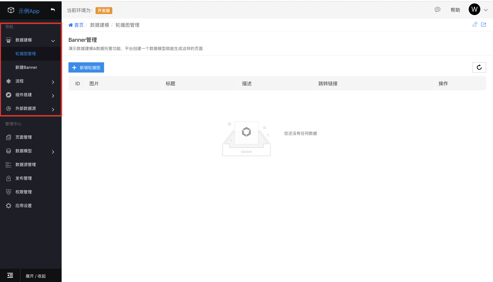
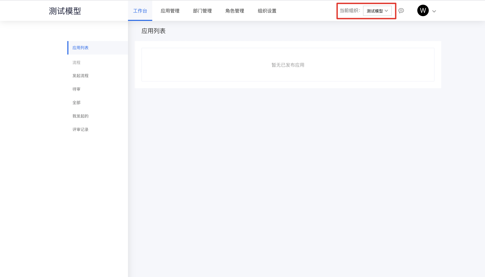
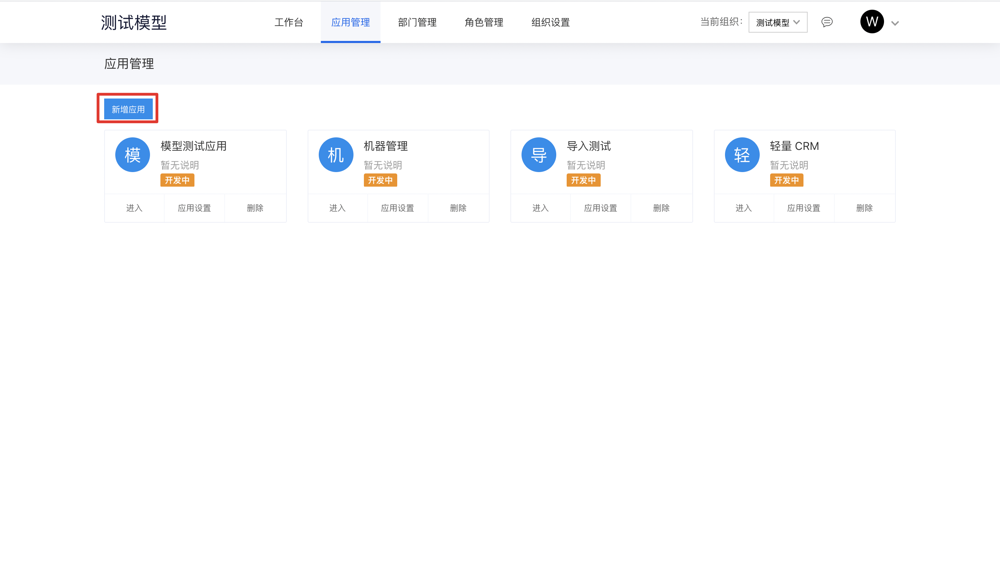
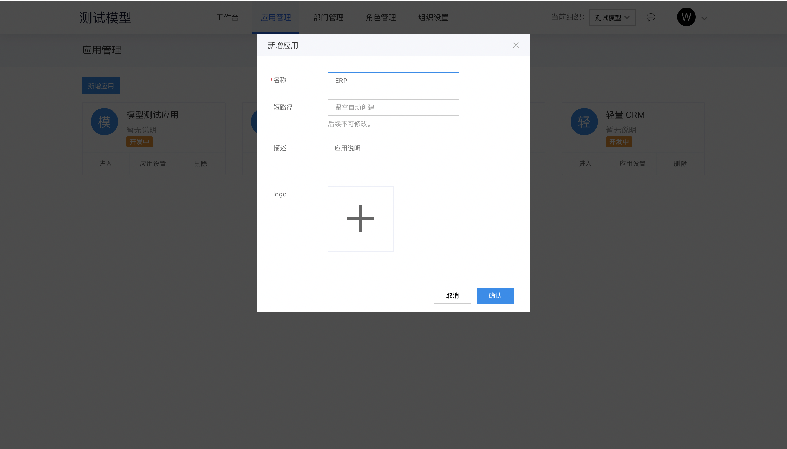
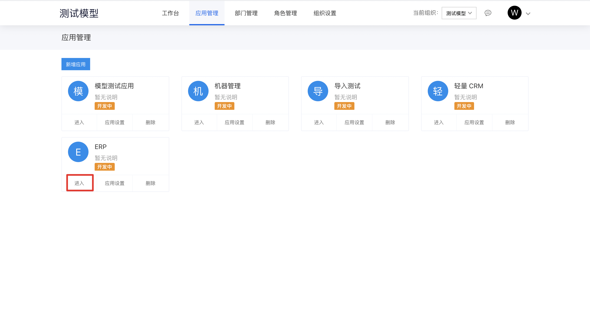

## 创建应用

### 进入爱速搭平台

建议新用户进入爱速搭平台后先查看平台使用流程讲解视频教程，快速掌握平台使用方法。

- **云官网登录方式**

1. 登录百度智能云[官网](https://cloud.baidu.com)。

2. 登录成功后，选择“产品服务>企业应用>爱速搭应用智能搭建平台”，进入管理页面，选择**进入工作台**。

- **爱速搭平台直接登录方式**

1. 进入爱速搭[工作台](https://aisuda.bce.baidu.com)，支持邮箱、百度智能云账号或微信登录。

2. 登录成功后，进入平台首页，选择所在的组织并进入。

> 说明：爱速搭平台账号以邮箱为唯一标识，其他登录方式都需要绑定开通账号时指定的邮箱。
>
> **建议首次使用百度账号登录，然后绑定邮箱，以便在云官网控制台能够快速进入爱速搭工作台**。

### 新建应用

1. 在新建应用前，建议您先查看平台为每个账号预装的示例 APP，快速了解平台搭建的应用。

2. 查看过程中可对示例 APP 进行编辑，或返回组织首页。

> 如需切换组织，可通过右上角的快捷入口进行切换。
>
> 

3. 在导航栏中点击**应用管理**进入应用管理页面，点击**新增应用**。

4. 填写应用基本信息后，点击**确认**。

5. 创建应用完成后，点击**进入**，进入应用编辑页面。

