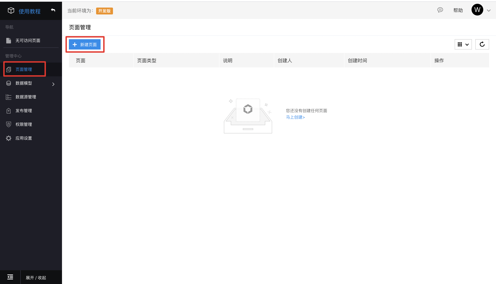
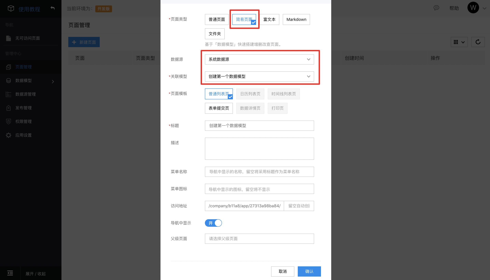
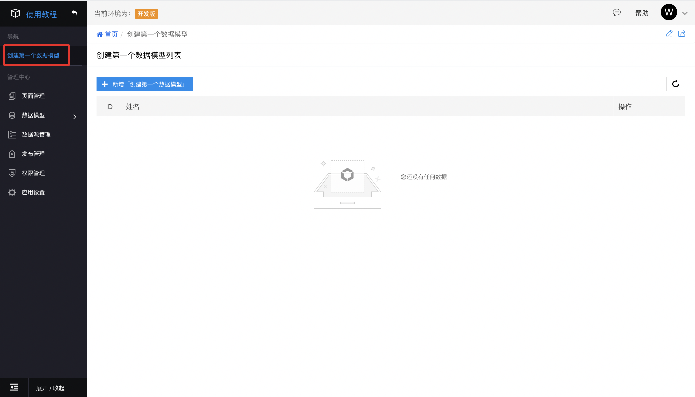

## 新建页面

### 首页设计

进入应用后，默认进入应用首页，应用首页是一个富文本页面类型，您可以对首页进行自定义设计。首页不在页面管理的页面列表中展示，可点击右上角编辑图标快速进入页面编辑环境。

### 新建页面

1. 点击左侧导航中的**页面管理**，进入页面管理页面。点击**新建页面**快速新建页面。

2. 根据您的需求，在**创建页面**弹框中完善页面创建信息，然后点击**确认**，完成页面创建。

 <table>
    <thead>
        <tr>
            <th style="width:75px">填写项</th>
            <th>说明</th>
        </tr>
    </thead>
    <tbody>
        <tr>
            <td>页面类型</td>
            <td>需要创建的页面类型： 
            • <strong>组件搭建页面：</strong>无数据托管功能，以 <a href="https://github.com/baidu/amis" target="_blank" rel="noopener">amis</a> 为核心进行组件搭建页面。 
            • <strong>模型页面：</strong>绑定数据模型，具有托管数据功能的页面。 
            • <strong>Markdown页面：</strong>展示 Markdown 的页面。 
            • <strong>富文本页面：</strong>展示富文本的页面。 
            • <strong>文件夹页面：</strong>文件夹页面不支持页面编辑，在页面层级中起占位作用，不存在实际的页面，但是在页面结构中会显示。</td>
        </tr>
        <tr>
            <td>数据源</td>
            <td>当选择<strong>模型页面</strong>时出现，选中模型的数据源，默认选择系统数据源，如果已接入外部数据源，可选择相应的数据源。</td>
        </tr>
        <tr>
            <td>关联模型</td>
            <td>当选择<strong>模型页面</strong>时出现，选中具体需要绑定的模型。</td>
        </tr>
        <tr>
            <td>页面模板</td>
            <td>当选择<strong>模型页面</strong>时出现，需要创建的页面模板。</td>
        </tr>
        <tr>
            <td>标题</td>
            <td>页面标题。</td>
        </tr>
        <tr>
            <td>描述</td>
            <td>页面的描述。</td>
        </tr>
        <tr>
            <td>菜单名称</td>
            <td>显示在左侧导航栏中的名称。</td>
        </tr>
        <tr>
            <td>菜单图标</td>
            <td>显示在左侧导航栏中的图标。</td>
        </tr>
        <tr>
            <td>访问地址</td>
            <td>页面访问地址，留空自动创建。</td>
        </tr>
        <tr>
            <td>导航中显示</td>
            <td>默认是否显示在左侧导航栏中。</td>
        </tr>
        <tr>
            <td>父级页面</td>
            <td>页面可嵌套布局，指定父级页面。</td>
        </tr>
    </tbody>
</table>

3. 以创建数据模型页面为例，在创建页面的弹窗中，选择**简易页面**，选择创建好的数据模型**创建第一个数据模型**，其他设置试用默认设置，点击确定完成页面创建。

4. 新建的页面会在页面管理中展示，也会展示在页面导航区域。

5. 设计好的页面可以点击页面列表操作栏的预览图标，或点击导航栏的页面名称进入预览环节。

6. 如需对页面进行更详细的编辑，可点击页面列表或页面右上角的编辑图标，进入编辑环境。数据模型页面的编辑项较多，在模型页面介绍章节会有更详细的说明。
