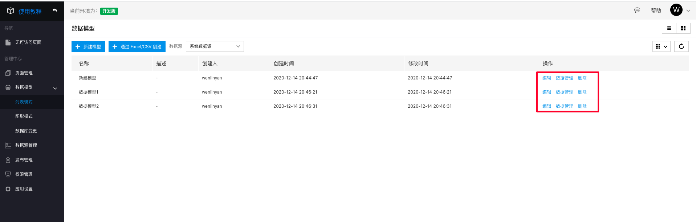
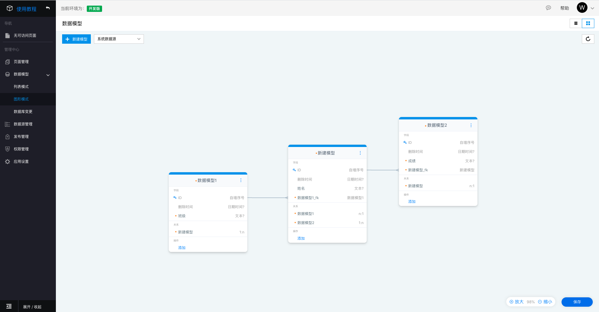

## 数据模型

数据模型是爱速搭的核心能力之一，基于数据模型可以实现一键页面生成、外部数据对接、流程设计等多项能力。数据模型可以映射到到数据库中的一张表，因此代替了传统数据建表的繁杂工作，也极大降低了数据库维护成本，

### 列表模式

列表模式可以通过操作栏的入口直接进入模型编辑环境和数据管理环境。

### 图形模式

图形模式可以直观地看到模型地字段信息和关系，也支持快速编辑的操作。

存在关联关系的模型之间，会有关系线连接，平台主要支持一对一关系、一对多关系、多对一关系、多对多关系。

### 数据库变更

模型相关的更新记录，都会在数据库变更信息中展示，包括 SQL 的变化、操作时间和操作人等信息。

