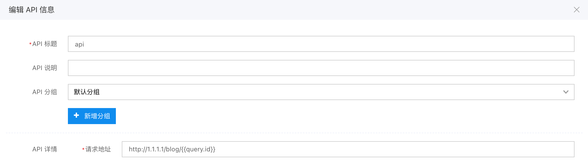

API 中心用于集中管理页面内的 API，比起直接填入 API 的方式，它增加了如下功能：

1. 方便对 API 进行调试
2. 每个 API 可以使用不同的签名方式
3. 支持对提交参数进行转换
4. 支持对返回结果进行转换
5. 自定义证书

## 使用方法

在开发版中左侧进入


## 签名方式

目前支持三种签名方式：

- HTTP 帐号密码。
- JWT，将会对所有 query 及 header 及进行签名，写入 header 的 Authorization 字段中。
- 百度云，将会对提交数据及 header 都做签名，写入 header 的 Authorization 字段中

对于私有部署版本，还支持自定义签名方式，请参考「[自定义后端插件](../../../私有部署/自定义后端插件.md)」。

## 参数映射

虽然 API 中心支持参数映射，但目前更推荐在页面编辑器中进行参数映射。

## URL 地址替换

「请求地址」支持变量替换，比如这个例子 `http://1.1.1.1/blog/{id}`，其中的 id 是动态的，而在实际前端调用的时候，请求地址是类似 `/api/center/nicaVyNdbGmHicn5b3EKkU`，如何将它映射到目标地址的路径中？

方法是首先在前端请求的时候映射 query，比如 `post:api://nicaVyNdbGmHicn5b3EKkU?id=${id}`，然后在 api 中的 url 地址填写 `http://1.1.1.1/blog/{{query.id}}`



除了 `query` 来获取 query，还有以下其它变量：

- `env`，环境变量
- `input`，提交参数
- `headers`，header

## 返回结果映射

假设接口返回格式是：

```json
{
  "error": 0,
  "error_msg": "",
  "result": {}
}
```

而 amis 期望的返回结果是

```json
{
  "status": 0,
  "msg": "",
  "data": {}
}
```

如何进行转换，方法是在 API 中心里开启「结果转换」


