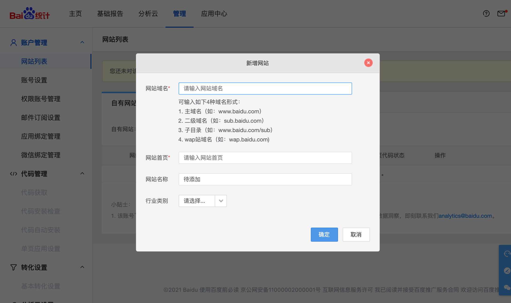
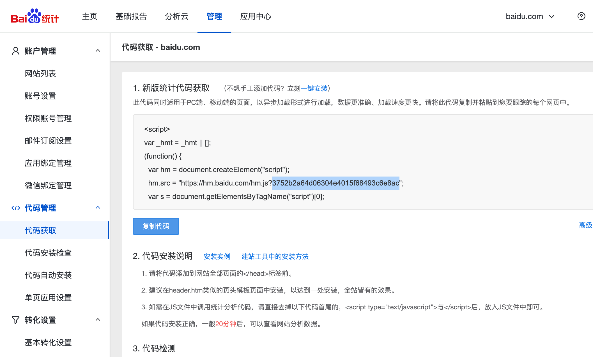

使用部署版本中支持嵌入百度/谷歌统计来统计使用情况。

## 百度统计

1. 首先去 `https://tongji.baidu.com/` 注册一个帐号，如果不是百度推广客户就选择「百度统计-站长版」
2. 然后新增站点
   
3. 完成后会出现一段代码，复制其中的 token，如下图所示
   
4. 将环境变量 `BAIDU_TONGJI_CODE` 的值设置为上面这个 token

## 谷歌统计

谷歌统计，使用环境变量 `GA_MEASUREMENT_ID`。
